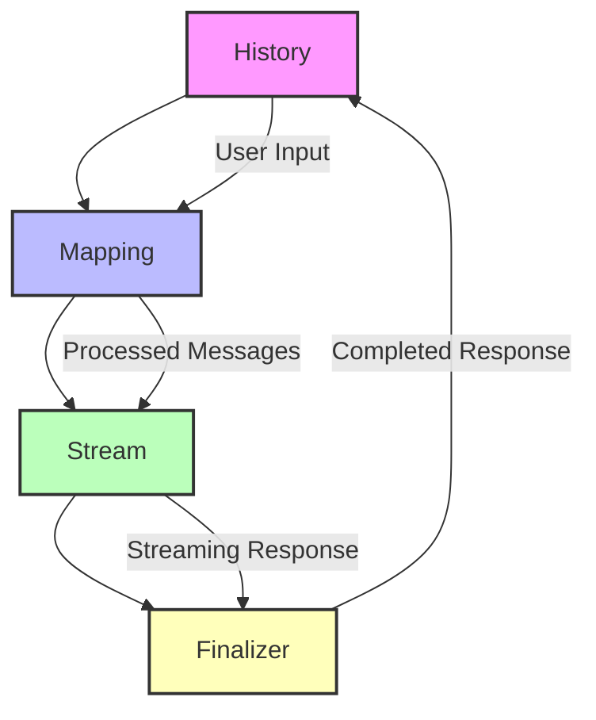

# Bedrock Nova Standardization

## Current Mapping Logic

The current Bedrock Nova provider implementation includes several key
components:

1. **Model Resolution**: The `resolveModelId` method maps standard Gemini IDs to
   Bedrock Nova equivalents, handling variants like `-flash` and `-pro`.
2. **Region Handling**: The provider automatically resolves prefixes (us. or
   eu.) based on the AWS region if not explicitly prefixed.
3. **Tool Forcing**: A forced schema tool (`FORCED_SCHEMA_TOOL`) ensures
   structured responses with thoughts/text separation and reliable tool calling.
4. **Stream Processing**: The `mapStreamResponse` method handles streaming
   responses, parsing partial JSON and managing tool calls.
5. **System Prompt Enhancement**: The `enhanceBedrockSystemPrompt` method adds
   critical behavioral rules to prevent repetition and ensure proper tool usage.

## Proposed High-Fidelity Refactor

Based on research into AWS documentation and best practices, the following
improvements are proposed:

### 1. Cross-Region Inference Best Practices

- **Data Encryption**: Ensure all data transferred between regions is encrypted
  in transit and at rest.
- **Regional Consistency**: Design systems to be region-aware with consistent
  behavior across regions.
- **Latency Optimization**: Implement caching strategies and optimize workflows
  to handle increased latency.
- **Fault Tolerance**: Add dual region support and redundant failover
  mechanisms.
- **Cost Management**: Monitor data transfer costs across regions.
- **Compliance**: Ensure data transfer complies with international regulations.

### 2. System Prompt Block Limitations

- **Length Restrictions**: Implement character limits to prevent resource
  exhaustion.
- **Content Security**: Allow only approved content types to mitigate security
  risks.
- **Formatting Requirements**: Enforce strict formatting rules for consistent
  processing.
- **Variable Restrictions**: Limit usage of sensitive environmental variables.
- **Permission Controls**: Restrict prompt execution permissions to limit
  operational impact.

### 3. Tool Use Stop Reason Behavior

- **Streaming Behavior**: When `end_turn` is encountered in streaming, ensure
  proper termination of the stream and cleanup of resources.
- **Tool Call Handling**: Improve parsing of tool calls in streaming mode to
  handle fragmented JSON.
- **Error Resilience**: Add better error handling for malformed tool calls in
  streaming responses.

## Turn-Lifecycle Architecture

The following Mermaid diagram illustrates the proposed turn-lifecycle
architecture:

This architecture ensures proper handling of the entire conversation lifecycle
from history processing through streaming responses to finalization.
